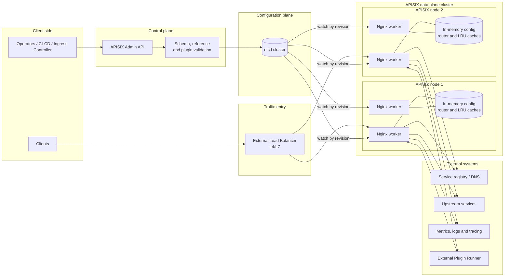
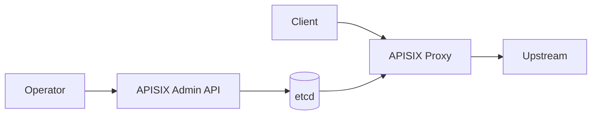
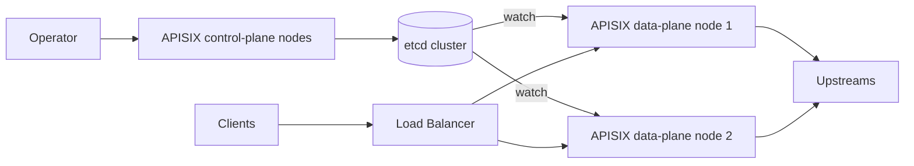
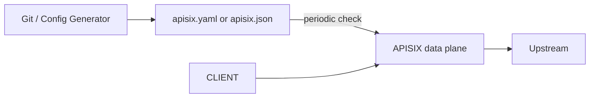
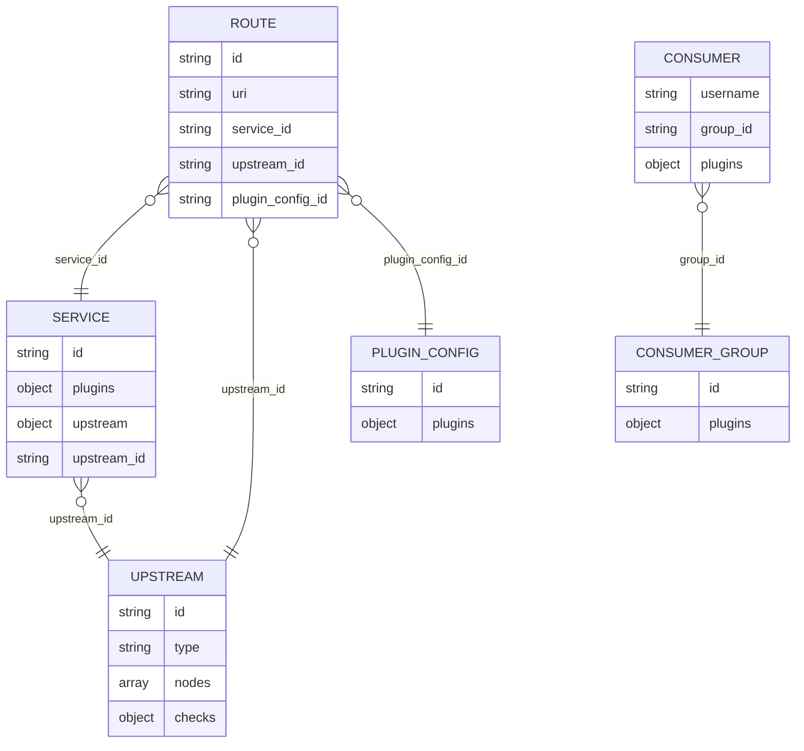
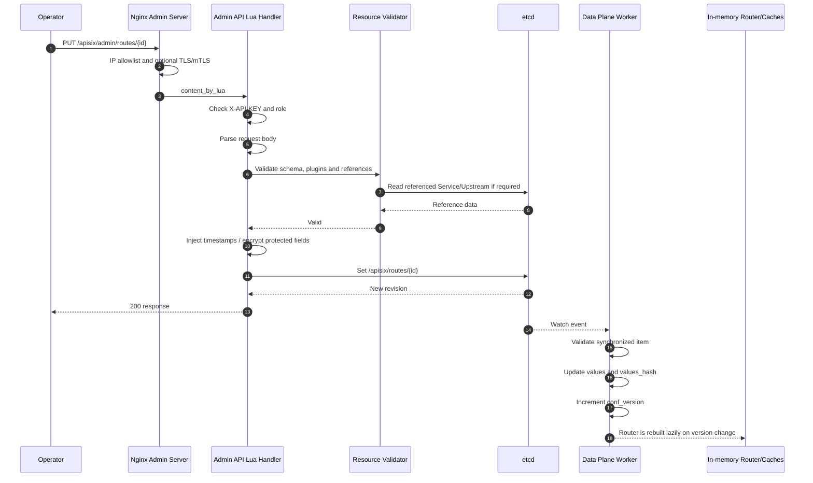
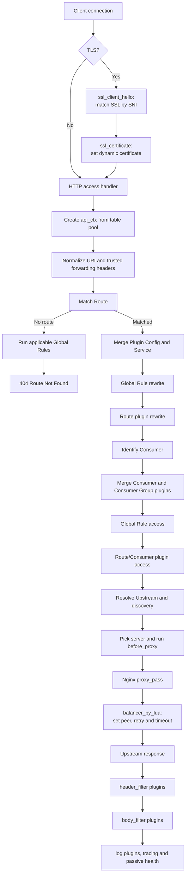
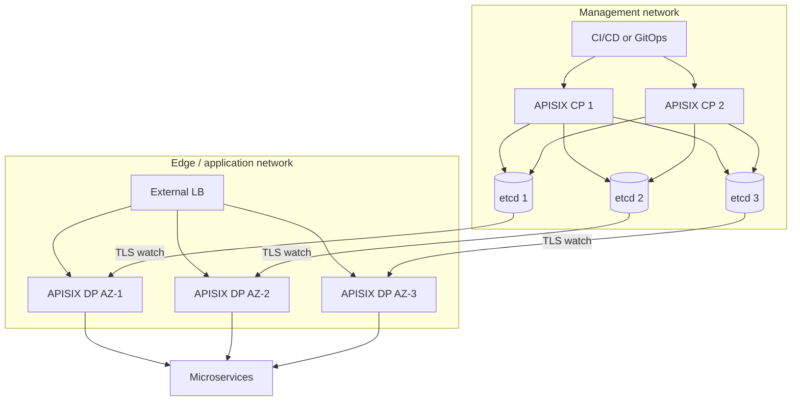

# Thiết kế kiến trúc Apache APISIX

> Phân tích từ mã nguồn và tài liệu chính thức của repository [`apache/apisix`](https://github.com/apache/apisix).  
> Snapshot mã nguồn: nhánh `master`, commit [`0f35b154824ed51d0d4bdadc78d1d5fa9ed1ec62`](https://github.com/apache/apisix/commit/0f35b154824ed51d0d4bdadc78d1d5fa9ed1ec62).  
> Ngày tổng hợp: 2026-07-21.

---

## 1. Mục tiêu và phạm vi

Tài liệu này trình bày kiến trúc APISIX ở mức triển khai và mã nguồn, tập trung vào:

- cách APISIX phân tách control plane, configuration plane và data plane;
- cách cấu hình được ghi, đồng bộ và đưa vào bộ nhớ của từng Nginx worker;
- pipeline xử lý một HTTP request từ lúc nhận kết nối đến khi ghi log;
- cơ chế route matching, plugin execution, upstream selection, health check và retry;
- các chế độ triển khai traditional, decoupled và standalone;
- cơ chế mở rộng bằng Lua plugin, external plugin runner và WebAssembly;
- đặc tính hiệu năng, tính sẵn sàng, consistency, failure mode và security boundary;
- bản đồ mã nguồn để tiếp tục nghiên cứu repository.

Tài liệu không cố gắng liệt kê toàn bộ plugin hoặc toàn bộ trường cấu hình. Trọng tâm là **các quyết định kiến trúc và luồng thực thi**.

---

## 2. Tóm tắt kiến trúc

Apache APISIX là một API Gateway được xây dựng trên Nginx/OpenResty, sử dụng LuaJIT để thực thi logic gateway và sử dụng etcd làm kho cấu hình động trong chế độ mặc định.

Có thể tóm tắt kiến trúc bằng năm quyết định chính:

1. **Đường xử lý request không truy vấn etcd**  
   Route, Service, Upstream, Consumer, SSL và cấu hình plugin được đồng bộ trước vào bộ nhớ của từng worker. Request được xử lý chủ yếu bằng cấu trúc dữ liệu trong memory.

2. **Control plane không nằm trên hot path**  
   Admin API xác thực, kiểm tra schema rồi ghi cấu hình vào etcd. Data plane nhận thay đổi bất đồng bộ bằng etcd watch.

3. **Nginx chịu trách nhiệm network I/O; Lua điều khiển chính sách**  
   Nginx quản lý socket, TLS, HTTP parsing, proxying, keepalive và event loop. Lua thực hiện route matching, plugin pipeline, discovery, chọn upstream và quan sát request.

4. **Upstream Nginx là một upstream động**  
   Nginx config chứa một upstream placeholder. `balancer_by_lua` chọn IP/port thực tế ở runtime, cho phép thay đổi node mà không reload Nginx.

5. **Plugin là đơn vị mở rộng chính**  
   Plugin được sắp theo priority và chạy theo phase. Cấu hình plugin có thể gắn vào Global Rule, Service, Plugin Config, Route, Consumer hoặc Consumer Group.

Nguồn chính:

- [`README.md`](https://github.com/apache/apisix/blob/0f35b154824ed51d0d4bdadc78d1d5fa9ed1ec62/README.md)
- [`docs/en/latest/architecture-design/apisix.md`](https://github.com/apache/apisix/blob/0f35b154824ed51d0d4bdadc78d1d5fa9ed1ec62/docs/en/latest/architecture-design/apisix.md)
- [`apisix/init.lua`](https://github.com/apache/apisix/blob/0f35b154824ed51d0d4bdadc78d1d5fa9ed1ec62/apisix/init.lua)
- [`apisix/cli/ngx_tpl.lua`](https://github.com/apache/apisix/blob/0f35b154824ed51d0d4bdadc78d1d5fa9ed1ec62/apisix/cli/ngx_tpl.lua)

---

## 3. Sơ đồ tổng thể



### 3.1. Ba plane cần phân biệt

| Plane | Vai trò | Có nằm trên request hot path không? |
|---|---|---:|
| Control plane | Tiếp nhận Admin API, xác thực, validate và ghi cấu hình | Không |
| Configuration plane | Lưu source of truth và phát thay đổi cấu hình | Không |
| Data plane | Match route, chạy plugin, chọn upstream và proxy traffic | Có |

Trong chế độ mặc định, etcd là **configuration plane**, không phải data plane. Việc etcd chậm hoặc tạm thời mất kết nối không làm mỗi request phải chờ etcd; data plane tiếp tục sử dụng snapshot cấu hình đã có trong memory.

---

## 4. Công nghệ nền tảng

### 4.1. Nginx và OpenResty

APISIX sử dụng Nginx làm network runtime:

- accept connection;
- HTTP parsing;
- TLS handshake;
- request/response buffering;
- upstream connection;
- keepalive;
- event-driven non-blocking I/O;
- worker-process model.

OpenResty/`ngx_lua` cho phép gắn Lua handler vào các Nginx phase. APISIX sinh file cấu hình Nginx từ template [`apisix/cli/ngx_tpl.lua`](https://github.com/apache/apisix/blob/0f35b154824ed51d0d4bdadc78d1d5fa9ed1ec62/apisix/cli/ngx_tpl.lua).

Các hook quan trọng:

```nginx
init_by_lua_block {
    apisix.http_init(args)
}

init_worker_by_lua_block {
    apisix.http_init_worker()
}

access_by_lua_block {
    apisix.http_access_phase()
}

balancer_by_lua_block {
    apisix.http_balancer_phase()
}

header_filter_by_lua_block {
    apisix.http_header_filter_phase()
}

body_filter_by_lua_block {
    apisix.http_body_filter_phase()
}

log_by_lua_block {
    apisix.http_log_phase()
}
```

### 4.2. LuaJIT

LuaJIT thực thi phần lớn logic gateway. Trong `apisix/init.lua`, APISIX cấu hình JIT, patch runtime rồi nạp các module core, plugin, router, upstream, SSL, discovery và Admin API.

Lua phù hợp với kiến trúc này vì:

- có chi phí gọi thấp bên trong Nginx worker;
- có thể thay đổi cấu hình và module mà không thay worker process;
- dễ mô hình hóa plugin theo các phase;
- dùng chung event loop với Nginx thay vì thêm một application server riêng.

### 4.3. etcd

etcd cung cấp:

- key-value store có revision;
- watch stream;
- transaction/compare-and-set;
- TTL/lease;
- replication và consistency của configuration store.

APISIX dùng các prefix như:

```text
/apisix/routes/
/apisix/services/
/apisix/upstreams/
/apisix/consumers/
/apisix/plugin_configs/
/apisix/global_rules/
/apisix/ssls/
/apisix/plugin_metadata/
/apisix/secrets/
/apisix/stream_routes/
```

Prefix thực tế phụ thuộc `etcd.prefix`, mặc định thường là `/apisix`.

### 4.4. Radixtree

Route được biên dịch thành router dựa trên `lua-resty-radixtree`. Tùy cấu hình, APISIX có thể dùng:

- `radixtree_uri`;
- `radixtree_uri_with_parameter`;
- `radixtree_host_uri`.

Router được rebuild khi `conf_version` của route hoặc service thay đổi, thay vì rebuild trên từng request.

---

## 5. Các chế độ triển khai

Nguồn: [`docs/en/latest/deployment-modes.md`](https://github.com/apache/apisix/blob/0f35b154824ed51d0d4bdadc78d1d5fa9ed1ec62/docs/en/latest/deployment-modes.md).

### 5.1. Traditional

Một APISIX instance đồng thời:

- nhận business traffic, thường trên `9080`;
- cung cấp Admin API, thường trên `9180`;
- đọc và ghi etcd.



Phù hợp cho:

- môi trường nhỏ hoặc trung bình;
- triển khai đơn giản;
- không cần tách security zone giữa management traffic và business traffic.

Hạn chế:

- cùng một binary/process topology phục vụ cả management và proxy;
- khó cô lập tài nguyên và network policy giữa control plane và data plane;
- mở rộng proxy traffic đồng thời làm tăng số instance có khả năng truy cập etcd/Admin components nếu không cấu hình chặt.

### 5.2. Decoupled

Control plane và data plane được triển khai độc lập.



Control-plane role:

- expose Admin API;
- validate và ghi etcd;
- không phục vụ business proxy traffic.

Data-plane role:

- phục vụ proxy traffic;
- đọc/watch etcd;
- có thể tắt Admin API;
- scale độc lập theo traffic.

Đây là mô hình phù hợp hơn cho production có yêu cầu:

- network segmentation;
- quản trị tập trung;
- scale data plane lớn;
- giảm management attack surface trên edge node.

### 5.3. Standalone file-driven

Không dùng etcd. APISIX đọc toàn bộ cấu hình từ:

- `conf/apisix.yaml`; hoặc
- `conf/apisix.json`.

File YAML phải kết thúc bằng `#END` để tránh đọc một file đang được ghi dở. APISIX kiểm tra thay đổi định kỳ, parse, validate và cập nhật bộ nhớ mà không thay worker process.



Phù hợp cho:

- GitOps;
- Kubernetes/Ingress Controller;
- hệ thống có configuration source khác và sinh full snapshot;
- muốn loại bỏ etcd khỏi topology.

Đánh đổi:

- update thường là snapshot lớn thay vì một resource nhỏ;
- cần đảm bảo atomic file replacement;
- không có Admin API CRUD theo resource như chế độ etcd.

### 5.4. Standalone API-driven

Cấu hình được lưu hoàn toàn trong memory và được thay bằng API full/partial snapshot có version. Chế độ này được thiết kế chủ yếu cho APISIX Ingress Controller/ADC và cần được dùng đúng theo tài liệu hiện hành.

Đặc điểm:

- không có etcd;
- API update mang `conf_version` theo loại resource;
- version lớn hơn mới được chấp nhận;
- có thể dùng digest để bỏ qua payload trùng;
- update vẫn là hot update trong memory.

### 5.5. So sánh

| Tiêu chí | Traditional | Decoupled | Standalone file | Standalone API |
|---|---|---|---|---|
| etcd | Có | Có | Không | Không |
| Admin API resource CRUD | Có | Trên control plane | Không | API snapshot riêng |
| Tách CP/DP | Không | Có | Không có CP APISIX truyền thống | Controller đóng vai trò nguồn cấu hình |
| Cập nhật nhỏ theo resource | Có | Có | Thường không | Theo resource type/snapshot |
| GitOps | Có thể | Có thể | Tự nhiên | Qua controller |
| Độ phức tạp vận hành | Trung bình | Cao hơn | Thấp hơn | Phụ thuộc controller |
| Phù hợp production lớn | Có giới hạn | Tốt nhất | Tùy use case | Tùy integration |

---

## 6. Mô hình tài nguyên cấu hình

### 6.1. Route

Route mô tả:

- điều kiện match: URI, host, method, remote address, Nginx variables;
- plugin áp dụng;
- upstream inline hoặc `upstream_id`;
- `service_id`;
- `plugin_config_id`;
- timeout, websocket và các thuộc tính proxy khác.

Route là điểm bắt đầu của request dispatch.

### 6.2. Service

Service gom cấu hình dùng chung giữa nhiều Route, chủ yếu:

- plugin;
- upstream hoặc `upstream_id`;
- host;
- timeout;
- websocket.

Khi request match Route có `service_id`, APISIX lấy Service từ memory và merge vào Route. Cấu hình trực tiếp trên Route có độ ưu tiên cao hơn Service.

### 6.3. Upstream

Upstream là abstraction của tập backend node cùng chính sách:

- load-balancing algorithm;
- node và weight;
- node priority;
- retry và timeout;
- health check;
- scheme;
- TLS/mTLS;
- service discovery.

Upstream có thể được:

- khai báo inline trong Route/Service;
- tạo thành resource độc lập rồi tham chiếu bằng `upstream_id`.

### 6.4. Plugin Config

Plugin Config tách một nhóm cấu hình plugin dùng chung thành resource riêng. Route liên kết qua `plugin_config_id`.

Mục đích:

- giảm lặp cấu hình;
- thay đổi một nơi cho nhiều Route;
- tách traffic match khỏi policy bundle.

### 6.5. Consumer và Consumer Group

Consumer biểu diễn API caller sau khi được authentication plugin nhận diện. Consumer có thể mang plugin riêng, ví dụ credential hoặc quota.

Consumer Group gom plugin dùng chung cho nhiều Consumer.

Plugin của Consumer được merge sau khi authentication plugin đã xác định caller.

### 6.6. Global Rule

Global Rule chạy plugin trên mọi request, kể cả khi không match Route. Global Rule là một pipeline riêng, không đơn thuần là một mức cấu hình được merge vào Route.

### 6.7. SSL

SSL resource lưu:

- certificate/key;
- SNI;
- client CA và mTLS policy;
- certificate dùng khi APISIX gọi upstream;
- TLS protocol options.

SSL được match động trong TLS phase theo SNI.

### 6.8. Secret, Proto, Plugin Metadata và Stream Route

- **Secret**: tham chiếu bí mật từ external secret manager hoặc cấu hình được bảo vệ.
- **Proto**: protobuf definition phục vụ gRPC transcoding.
- **Plugin Metadata**: cấu hình plugin ở cấp toàn cục nhưng thuộc riêng plugin.
- **Stream Route**: route cho TCP/UDP/TLS trong Nginx stream subsystem.

### 6.9. Quan hệ giữa các resource



### 6.10. Thứ tự cấu hình plugin

Đối với plugin cùng tên, thứ tự ưu tiên cấu hình thông thường là:

```text
Consumer > Route > Plugin Config > Service
```

Global Rule chạy riêng và thường chạy trước plugin gắn với các resource trên. Một số plugin có `run_policy = prefer_route`, khi đó instance trên Route có thể khiến instance Global Rule cùng tên bị bỏ qua.

Không nên hiểu priority cấu hình và priority thực thi là cùng một khái niệm:

- **merge precedence** quyết định cấu hình instance nào được giữ;
- **plugin priority** quyết định thứ tự các plugin được chạy trong cùng phase.

---

## 7. Khởi động APISIX

### 7.1. `init_by_lua`

`apisix.http_init()` thực hiện các công việc cấp process:

- khởi tạo DNS resolver;
- khởi tạo ID và environment;
- bật privileged agent;
- khởi tạo config provider;
- khởi tạo xRPC.

Config provider được chọn trong [`apisix/core.lua`](https://github.com/apache/apisix/blob/0f35b154824ed51d0d4bdadc78d1d5fa9ed1ec62/apisix/core.lua):

- `config_etcd`;
- `config_yaml`;
- JSON được xử lý qua `config_yaml` với parser JSON.

### 7.2. `init_worker_by_lua`

Mỗi Nginx worker gọi `apisix.http_init_worker()` để khởi tạo:

- worker event bus;
- LRU cache;
- service discovery;
- balancer và health check;
- Admin API;
- timer;
- config watcher;
- plugin runtime;
- HTTP router;
- Service, Plugin Config, Consumer, Consumer Group;
- Secret, Global Rule, Upstream;
- external plugin runtime;
- Control API;
- Prometheus exporter;
- trusted-address configuration.

Điều này có nghĩa rằng mỗi worker có cấu trúc Lua và cache riêng. Một số trạng thái cần chia sẻ giữa worker được đặt trong Nginx shared dictionary hoặc external store.

---

## 8. Luồng cập nhật cấu hình qua Admin API

Nguồn chính:

- [`apisix/admin/init.lua`](https://github.com/apache/apisix/blob/0f35b154824ed51d0d4bdadc78d1d5fa9ed1ec62/apisix/admin/init.lua)
- [`apisix/admin/resource.lua`](https://github.com/apache/apisix/blob/0f35b154824ed51d0d4bdadc78d1d5fa9ed1ec62/apisix/admin/resource.lua)
- [`apisix/admin/routes.lua`](https://github.com/apache/apisix/blob/0f35b154824ed51d0d4bdadc78d1d5fa9ed1ec62/apisix/admin/routes.lua)

### 8.1. Sequence



### 8.2. Các lớp kiểm tra

Admin API thực hiện:

1. network allowlist tại Nginx;
2. optional TLS/mTLS;
3. API key;
4. role `viewer` chỉ được GET;
5. JSON/body parsing;
6. JSON Schema validation;
7. plugin-specific schema validation;
8. reference validation như `service_id`, `upstream_id`, `plugin_config_id`;
9. validation biểu thức route;
10. mã hóa một số dữ liệu nhạy cảm trước khi ghi.

Data plane **validate lại** dữ liệu nhận từ etcd. Nếu một item không hợp lệ, worker bỏ qua update đó thay vì đưa cấu hình sai vào hot path.

### 8.3. Consistency

Admin API trả về thành công khi write vào etcd thành công. Việc mọi worker của mọi data-plane node đã nhận và áp dụng revision mới là quá trình bất đồng bộ.

Do đó:

- hệ thống có **strong consistency tại configuration store**;
- nhưng có **eventual convergence tại in-memory data plane**;
- trong một khoảng ngắn, hai worker hoặc hai node có thể phục vụ bằng revision khác nhau.

APISIX không tạo một global barrier để dừng traffic cho đến khi mọi worker đã apply xong.

### 8.4. Multi-resource update

Khi cập nhật Route, Service và Upstream bằng nhiều Admin API call độc lập, mỗi call tạo revision riêng. Data plane có thể quan sát trạng thái trung gian.

Các biện pháp giảm rủi ro:

- tạo resource được tham chiếu trước, Route sau;
- update Upstream độc lập trước khi chuyển Route;
- dùng ID version mới rồi đổi reference;
- dùng GitOps/full snapshot trong standalone khi cần consistency ở mức snapshot;
- thiết kế cấu hình backward-compatible trong giai đoạn chuyển tiếp.

---

## 9. Đồng bộ cấu hình từ etcd

Nguồn: [`apisix/core/config_etcd.lua`](https://github.com/apache/apisix/blob/0f35b154824ed51d0d4bdadc78d1d5fa9ed1ec62/apisix/core/config_etcd.lua).

### 9.1. Initial full load

Trong giai đoạn khởi tạo, APISIX đọc toàn bộ prefix cấu hình và phân loại dữ liệu vào `loaded_configuration`.

Mục đích:

- tránh mỗi module Route/Service/Upstream mở một full read riêng;
- có snapshot khởi động tương đối đồng nhất;
- giảm số round trip tới etcd.

Sau đó các module tạo logical config object bằng `core.config.new("/routes", ...)`, `core.config.new("/services", ...)`, v.v.

### 9.2. Một main watch và nhiều logical subscriber

Trong mỗi worker, `config_etcd.lua` duy trì một main watch trên prefix cấu hình. Kết quả watch được đưa vào queue nội bộ. Các config object cho từng key:

- theo dõi index riêng;
- lọc event theo prefix của mình;
- chờ bằng semaphore;
- cập nhật `values` và `values_hash`.

Thiết kế này tránh việc mỗi loại resource phải mở một watch connection độc lập.

### 9.3. Revision tracking

Mỗi object giữ:

- `prev_index`;
- `conf_version`;
- `need_reload`;
- `values`;
- `values_hash`.

Khi nhận event:

- revision thấp hơn kỳ vọng được bỏ qua hoặc kích hoạt resync;
- event mới cập nhật/invalidate item;
- `conf_version` tăng;
- cleanup handlers của item cũ được gọi;
- router và LRU cache sử dụng version để tự invalidation.

### 9.4. Compaction và restart

Nếu etcd đã compact revision mà watcher cần, hoặc revision bị lùi do restart:

1. watcher đánh dấu cần reload;
2. thực hiện full `readdir`;
3. dựng lại toàn bộ local snapshot;
4. tiếp tục watch từ revision mới.

### 9.5. Mất kết nối etcd

Worker:

- tiếp tục dùng cấu hình hiện có;
- retry với backoff và jitter;
- health-check các etcd endpoint;
- resync sau khi kết nối lại.

Điểm quan trọng: traffic hiện tại không phụ thuộc vào một etcd call. Tuy nhiên, một node mới khởi động mà chưa có snapshot hợp lệ có thể không sẵn sàng nhận traffic.

### 9.6. Readiness

Mỗi worker ghi trạng thái nhận cấu hình vào shared dictionary. Endpoint readiness kiểm tra:

- đủ số worker report;
- mọi worker đã nhận configuration;
- service discovery cần thiết đã ready.

Vì vậy nên dùng `/status/ready` cho load balancer/Kubernetes readiness thay vì chỉ kiểm tra process còn sống.

---

## 10. Pipeline xử lý HTTP request

Nguồn:

- [`apisix/init.lua`](https://github.com/apache/apisix/blob/0f35b154824ed51d0d4bdadc78d1d5fa9ed1ec62/apisix/init.lua)
- [`apisix/cli/ngx_tpl.lua`](https://github.com/apache/apisix/blob/0f35b154824ed51d0d4bdadc78d1d5fa9ed1ec62/apisix/cli/ngx_tpl.lua)

### 10.1. Tổng quan



### 10.2. TLS phase

Khi TLS được bật:

1. `ssl_client_hello_by_lua` lấy SNI;
2. SSL router match certificate config;
3. TLS protocol policy được áp dụng;
4. `ssl_certificate_by_lua` đặt cert/key động;
5. optional downstream mTLS được kiểm tra;
6. APISIX kiểm tra một số trường hợp session resumption để tránh bypass mTLS.

Nginx vẫn cần certificate mặc định trong config, nhưng certificate thực tế có thể được thay động theo SNI.

### 10.3. Tạo `api_ctx`

Trong access phase, APISIX lấy table từ `tablepool` để tạo `api_ctx`.

`api_ctx` giữ trạng thái xuyên suốt request:

- normalized variables;
- matched Route/Service/Consumer;
- plugin list;
- upstream config;
- selected server;
- trace span;
- health checker;
- route/service IDs;
- các cờ do plugin đặt.

Cuối log phase, table được clear/release về pool để giảm allocation và GC pressure.

### 10.4. URI normalization và trust boundary

Trước route matching, APISIX:

- chuẩn hóa URI;
- có tùy chọn xử lý matrix parameter theo servlet;
- bảo vệ các trường hợp encoded slash/path traversal;
- lưu URI gốc riêng;
- làm sạch hoặc ghi đè `X-Forwarded-*` nếu peer không nằm trong trusted addresses.

Điều này ngăn client giả mạo forwarding chain nếu APISIX được đặt sau load balancer/reverse proxy.

### 10.5. Route match

HTTP router nhận:

- URI;
- method;
- host;
- remote address;
- Nginx variables;
- optional custom filter.

Kết quả match được lưu vào `api_ctx.matched_route`.

Nếu không match Route:

- Global Rule rewrite/access vẫn có thể chạy;
- APISIX trả `404 Route Not Found`.

### 10.6. Merge cấu hình

Sau khi match:

1. merge `Plugin Config` vào Route;
2. nếu có `service_id`, lấy Service và merge;
3. Route override các trường tương ứng của Service;
4. đặt `conf_type`, `conf_version`, `conf_id` để cache và trace;
5. chạy plugin rewrite;
6. authentication plugin có thể đặt `api_ctx.consumer`;
7. merge Consumer/Consumer Group plugin;
8. chạy phần rewrite mới đến từ Consumer;
9. chạy access plugins.

### 10.7. Một điểm dễ hiểu sai về phase

APISIX gọi cả plugin `rewrite` và `access` từ `apisix.http_access_phase()`, được gắn vào Nginx `access_by_lua_block`.

Do đó:

- tên phase của APISIX phản ánh semantic plugin pipeline;
- không phải mọi phase APISIX ánh xạ một-một với Nginx phase cùng tên;
- priority chỉ sắp plugin **trong cùng APISIX phase**.

### 10.8. Resolve upstream

`handle_upstream()`:

- chọn `upstream_id` hoặc upstream inline;
- hỗ trợ upstream bị thay bởi plugin như `traffic-split`;
- gọi service discovery nếu có `service_name`;
- resolve DNS node nếu cần;
- xác định scheme;
- lấy health checker;
- chọn server ban đầu;
- đặt Host/X-Forwarded header;
- chạy plugin `before_proxy`.

Một số plugin như AI proxy có thể tự gọi upstream bằng HTTP client và đặt cờ bypass Nginx upstream.

### 10.9. Proxy và balancer phase

Template Nginx khai báo:

```nginx
upstream apisix_backend {
    server 0.0.0.1;

    balancer_by_lua_block {
        apisix.http_balancer_phase()
    }
}
```

`server 0.0.0.1` chỉ là placeholder để Nginx chấp nhận cấu hình. Peer thật được đặt trong `balancer_by_lua`.

Điều này cho phép:

- thay node runtime;
- retry sang node khác;
- dùng discovery;
- áp dụng health state;
- dùng round-robin, consistent hash, least connections hoặc algorithm khác;
- không reload Nginx khi Upstream đổi.

### 10.10. Response phases

- `header_filter`: sửa status/header, thêm server header, chạy plugin header filter.
- `body_filter`: xử lý từng response chunk; có thể chạy nhiều lần.
- `log`: hoàn tất tracing, chạy logger plugin, passive health check, release picker/context/cache objects.

Plugin trong `log` không nên cố thay đổi response đã gửi.

---

## 11. Kiến trúc Router

Nguồn:

- [`apisix/router.lua`](https://github.com/apache/apisix/blob/0f35b154824ed51d0d4bdadc78d1d5fa9ed1ec62/apisix/router.lua)
- [`apisix/http/route.lua`](https://github.com/apache/apisix/blob/0f35b154824ed51d0d4bdadc78d1d5fa9ed1ec62/apisix/http/route.lua)
- [`apisix/http/router/radixtree_uri.lua`](https://github.com/apache/apisix/blob/0f35b154824ed51d0d4bdadc78d1d5fa9ed1ec62/apisix/http/router/radixtree_uri.lua)
- [Router documentation](https://apisix.apache.org/docs/apisix/terminology/router/)

### 11.1. Build model

Route config object được tạo bằng:

```lua
core.config.new("/routes", {
    automatic = true,
    item_schema = core.schema.route,
    checker = check_route,
    filter = filter,
})
```

Route mới được:

- schema validate;
- plugin validate;
- expression validate;
- normalize host về lowercase;
- normalize upstream;
- gắn metadata cho plugin.

### 11.2. Lazy rebuild

`radixtree_uri.match()` so sánh:

- `user_routes.conf_version`;
- `service_version`.

Chỉ khi version thay đổi, router tree mới được dựng lại. Request bình thường chỉ dispatch trên tree hiện có.

### 11.3. Điều kiện match

Một route record có thể chứa:

- `paths`;
- `methods`;
- `priority`;
- `hosts`;
- `remote_addrs`;
- `vars`;
- `filter_func`;
- handler đặt matched route vào context.

### 11.4. Router variants

- `radixtree_uri`: index chính theo URI, hiệu năng tốt.
- `radixtree_uri_with_parameter`: thêm path parameter.
- `radixtree_host_uri`: index theo host + URI, phù hợp nhiều virtual host.

Chọn router là tradeoff giữa:

- tốc độ;
- độ phức tạp rule;
- nhu cầu host-based dispatch;
- path parameter.

### 11.5. Route priority

Route priority giải quyết trường hợp nhiều route cùng match. Nó khác với plugin priority.

---

## 12. Kiến trúc Plugin

Nguồn:

- [`apisix/plugin.lua`](https://github.com/apache/apisix/blob/0f35b154824ed51d0d4bdadc78d1d5fa9ed1ec62/apisix/plugin.lua)
- [`docs/en/latest/plugin-develop.md`](https://github.com/apache/apisix/blob/0f35b154824ed51d0d4bdadc78d1d5fa9ed1ec62/docs/en/latest/plugin-develop.md)
- [`docs/en/latest/terminology/plugin.md`](https://github.com/apache/apisix/blob/0f35b154824ed51d0d4bdadc78d1d5fa9ed1ec62/docs/en/latest/terminology/plugin.md)

### 12.1. Plugin contract

Một Lua plugin thường export table:

```lua
local _M = {
    version = 0.1,
    priority = 1000,
    name = "example",
    schema = schema,
}
```

Có thể cung cấp:

```lua
function _M.check_schema(conf, schema_type) end
function _M.init() end
function _M.init_worker() end
function _M.destroy() end

function _M.rewrite(conf, ctx) end
function _M.access(conf, ctx) end
function _M.before_proxy(conf, ctx) end
function _M.header_filter(conf, ctx) end
function _M.body_filter(conf, ctx) end
function _M.log(conf, ctx) end
```

### 12.2. Load và hot reload

Plugin loader:

1. đọc danh sách plugin được enable;
2. unload module cũ khỏi `package.loaded`;
3. `require("apisix.plugins." .. name)`;
4. kiểm tra `priority`, `version`, `schema`;
5. gọi `init`;
6. sort giảm dần theo priority;
7. tạo hash theo name.

**Hot reload không có nghĩa là APISIX tải source code mới từ etcd.** Code plugin phải tồn tại trong filesystem/image hoặc được cung cấp qua external plugin runner. Hot reload chủ yếu nạp lại module/list đã được triển khai.

### 12.3. Plugin list cho request

`plugin.filter()` tạo array phẳng:

```text
plugin_object_1, plugin_conf_1,
plugin_object_2, plugin_conf_2,
...
```

Cấu trúc này giảm số object trung gian trong hot path.

Plugin có thể bị bỏ qua bởi:

- không có config;
- `_meta.disable`;
- `run_policy`;
- consumer rewrite đã chạy;
- `_meta.filter`;
- workflow đã đánh dấu skip.

### 12.4. Priority

Mặc định plugin được sắp giảm dần theo `plugin.priority`.

Một plugin instance có thể override bằng:

```json
{
  "_meta": {
    "priority": 3010
  }
}
```

Priority chỉ áp dụng trong cùng phase. Ví dụ plugin chạy ở `rewrite` luôn xảy ra trước plugin chỉ chạy ở `body_filter`, bất kể priority số học.

### 12.5. Metadata hooks

`_meta` hỗ trợ các khả năng như:

- `disable`;
- `priority`;
- `filter`;
- `pre_function`;
- `error_response`.

`_meta.filter` được compile thành expression và cache. `pre_function` cho phép chạy Lua function trước plugin, nhưng mở rộng attack surface và cần xem là trusted code.

### 12.6. Short-circuit

Trong rewrite/access/before_proxy, plugin có thể trả status/body. Plugin runner gọi `core.response.exit()` và kết thúc request.

Đây là cơ chế cho:

- authentication failure;
- rate limiting;
- IP restriction;
- redirect;
- mocking;
- fault injection.

### 12.7. Schema và secret

Plugin schema được kiểm tra:

- khi Admin API nhận write;
- khi data plane đồng bộ config.

Các reference `$secret://` và `$env://` được resolve trước khi thực thi plugin. APISIX dùng weak-key cache để tránh deep-copy lại cấu hình khi secret không thay đổi.

### 12.8. Global Rule execution

Global Rules được hợp nhất thành một cấu hình tạm và chạy theo phase. Nếu cùng một plugin xuất hiện trong nhiều Global Rule, code hiện tại loại plugin trùng khỏi execution list và log lỗi để tránh ambiguity.

### 12.9. External plugin runner

External plugins cho phép viết logic bằng Go, Java, Python hoặc ngôn ngữ khác. APISIX giao tiếp với plugin runner và đặt chúng vào các điểm như:

- trước Lua plugin;
- sau Lua plugin nhưng trước upstream;
- sau upstream response.

Tradeoff:

- tăng latency do IPC/serialization;
- thêm failure mode của plugin runner;
- có thể cấu hình degradation;
- tách crash/resource isolation tốt hơn so với chạy toàn bộ code trong Lua worker.

### 12.10. WebAssembly

APISIX có runtime cho Proxy-Wasm plugin. Đây là extension path có sandbox tốt hơn native/Lua code, nhưng tài liệu hiện hành vẫn cần được kiểm tra theo version vì mức hỗ trợ có thể khác giữa các phase và runtime.

---

## 13. Upstream, discovery và load balancing

Nguồn:

- [`apisix/upstream.lua`](https://github.com/apache/apisix/blob/0f35b154824ed51d0d4bdadc78d1d5fa9ed1ec62/apisix/upstream.lua)
- [`apisix/balancer.lua`](https://github.com/apache/apisix/blob/0f35b154824ed51d0d4bdadc78d1d5fa9ed1ec62/apisix/balancer.lua)
- [Upstream documentation](https://apisix.apache.org/docs/apisix/terminology/upstream/)
- [Health-check documentation](https://apisix.apache.org/docs/apisix/tutorials/health-check/)

### 13.1. Nguồn node

Upstream node có thể đến từ:

1. static node trong cấu hình;
2. DNS name;
3. service discovery;
4. plugin thay upstream, ví dụ traffic split.

Với service discovery, upstream chứa:

```json
{
  "service_name": "order-service",
  "discovery_type": "nacos",
  "type": "roundrobin"
}
```

Data plane gọi discovery adapter để lấy node. Node version được đưa vào upstream version để invalidate picker cache.

### 13.2. Chuẩn hóa node

APISIX chuẩn hóa:

- host;
- port theo scheme;
- IPv6 bracket;
- weight;
- priority;
- domain metadata.

### 13.3. Balancer picker cache

Balancer dùng LRU cache cho:

- server picker;
- health status;
- parsed address.

Cache key gồm upstream resource key và version. Khi Upstream hoặc discovery node thay đổi, version đổi và picker mới được tạo.

### 13.4. Node priority

Node được nhóm theo priority. Priority balancer chọn nhóm ưu tiên cao trước; bên trong nhóm dùng algorithm được cấu hình.

Điều này hỗ trợ:

- active/standby data center;
- fallback pool;
- migration theo tier.

### 13.5. Health check

APISIX hỗ trợ:

- active check;
- passive check.

Active check chủ động probe HTTP/HTTPS/TCP. Passive check dùng kết quả traffic thực để report timeout, TCP failure hoặc HTTP status.

Một chi tiết trong code hiện tại: khi health checker cho rằng **tất cả node đều unhealthy**, balancer có thể fallback về toàn bộ node thay vì không chọn node nào. Đây là lựa chọn thiên về availability; cần hiểu rõ khi thiết kế fail-open/fail-closed.

### 13.6. Retry

Nếu `retries` không cấu hình hoặc âm, code có thể mặc định theo số node trừ một.

Trong mỗi retry:

- lấy failure trước;
- report vào health checker;
- đánh dấu node đã thử nếu picker hỗ trợ;
- chọn node tiếp theo;
- giữ cùng picker trong toàn request.

`retry_timeout` có thể đặt deadline cho tổng retry.

### 13.7. Timeout precedence

Timeout trên Route có độ ưu tiên cao hơn timeout trên Upstream. Balancer đặt:

- connect timeout;
- send timeout;
- read timeout.

### 13.8. Consistent hash

Với consistent hash, node selection phụ thuộc key như client IP, header, cookie hoặc variable. Health filtering phải giữ tính ổn định của ring, nên code xử lý health status khác một số algorithm khác.

### 13.9. Keepalive

Nginx quản lý upstream keepalive pool. APISIX thay peer động nhưng vẫn tận dụng keepalive thông qua Nginx/APISIX runtime.

---

## 14. TLS và certificate management

### 14.1. Downstream TLS

SSL object được đồng bộ vào memory và match bằng SNI trong `ssl_client_hello`/`ssl_certificate` phase.

Cho phép:

- thêm certificate không reload Nginx;
- nhiều domain trên cùng listener;
- wildcard SNI;
- certificate rotation;
- per-SNI TLS policy.

### 14.2. Downstream mTLS

SSL object có thể yêu cầu client certificate. APISIX kiểm tra:

- certificate có mặt;
- verification result;
- SNI/Host relationship;
- TLS session resumption consistency;
- optional URI exclusion policy.

### 14.3. Upstream TLS/mTLS

Upstream có thể dùng:

- HTTPS/gRPCS;
- SNI;
- trusted CA;
- client certificate/key;
- SSL object được tham chiếu bằng ID.

Private key được parse/cache và đưa vào upstream SSL handshake qua APISIX runtime API.

---

## 15. Admin API, Control API và status endpoint

Ba nhóm endpoint không nên nhầm lẫn.

### 15.1. Admin API

Mục đích: CRUD cấu hình.

Ví dụ:

```text
/apisix/admin/routes
/apisix/admin/services
/apisix/admin/upstreams
/apisix/admin/consumers
/apisix/admin/ssls
```

Bảo vệ bằng:

- network allowlist;
- API key;
- role;
- TLS/mTLS tùy cấu hình.

### 15.2. Control API

Mục đích: inspection/runtime control, ví dụ schema, discovery dump hoặc thông tin nội bộ. Nó không thay thế Admin API resource model.

Control API thường nên chỉ expose trên management network/local interface.

### 15.3. Status API

- `/status`: process liveness cơ bản;
- `/status/ready`: readiness của configuration/discovery.

Prometheus exporter có thể chạy trên listener riêng.

---

## 16. HTTP và Stream subsystem

APISIX không chỉ proxy HTTP. Nginx stream subsystem hỗ trợ TCP/UDP/TLS proxy.

Stream có:

- `stream_routes`;
- stream plugin list riêng;
- IP/port router;
- stream SSL handling;
- dynamic balancer;
- config watcher tương ứng.

Không nên giả định mọi HTTP plugin hoặc phase đều dùng được cho stream. Plugin stream nằm trong namespace và lifecycle riêng.

---

## 17. Cơ chế hiệu năng

### 17.1. Không gọi configuration store trên hot path

Đây là tối ưu quan trọng nhất. etcd chỉ tham gia control/config propagation.

### 17.2. Event-driven worker

Mỗi Nginx worker xử lý nhiều connection bằng event loop. Không có một thread Java/OS riêng cho mỗi request.

Plugin phải tránh:

- blocking filesystem I/O;
- blocking DNS/client library;
- CPU loop dài;
- gọi external service không timeout;
- xử lý body lớn không kiểm soát.

Một plugin blocking có thể làm giảm khả năng phục vụ của cả worker.

### 17.3. Lazy rebuild theo version

Router/picker/cache chỉ rebuild khi version thay đổi.

### 17.4. LRU cache

Các cache đáng chú ý:

- merged Service/Route;
- merged Consumer/Route;
- global rule merge;
- expression compile;
- plugin secret resolution;
- server picker;
- health state;
- parsed address;
- SSL object/certificate parsing.

### 17.5. Table pool

`api_ctx`, plugin list, route match options và một số table tạm được tái sử dụng nhằm giảm GC.

### 17.6. Precomputed plugin order

Plugin được sort khi load, không sort lại toàn bộ trên mỗi request trừ khi instance override `_meta.priority`.

---

## 18. High availability và failure modes

### 18.1. APISIX data-plane node hỏng

Ảnh hưởng:

- connection trên node đó bị mất;
- node khác tiếp tục phục vụ nếu có external load balancer;
- cấu hình có thể dựng lại từ etcd/file khi node khởi động lại.

Khuyến nghị:

- tối thiểu hai data-plane node;
- readiness probe;
- connection draining;
- external LB phân phối đa AZ khi cần.

### 18.2. Control plane hỏng

Nếu etcd và data plane vẫn hoạt động:

- traffic tiếp tục;
- không thể hoặc khó thực hiện thay đổi mới qua Admin API;
- data plane không bị ảnh hưởng trực tiếp.

### 18.3. etcd tạm thời unavailable

Data plane đang chạy:

- tiếp tục dùng config trong memory;
- không nhận update mới;
- watcher retry.

Control plane:

- Admin API write/read có thể trả 503.

Data plane mới khởi động:

- có thể không ready nếu không lấy được snapshot.

### 18.4. etcd mất dữ liệu

Đây là sự cố nghiêm trọng vì etcd là source of truth trong chế độ etcd. In-memory snapshot trên các node không phải backup lâu dài.

Cần:

- etcd cluster HA;
- snapshot/restore;
- TLS và RBAC;
- disk monitoring;
- quota/compaction/defragmentation;
- kiểm thử restore.

### 18.5. Upstream hỏng

APISIX có thể:

- loại node bằng health check;
- retry;
- chuyển priority group;
- circuit breaking hoặc traffic split qua plugin;
- trả 502/503/504 khi không thể proxy.

### 18.6. Service discovery hỏng

Tùy discovery implementation:

- có thể tiếp tục dùng node snapshot cũ;
- không thấy node mới;
- readiness có thể fail nếu discovery chưa ready;
- route dùng discovery có thể trả 503 nếu không có node hợp lệ.

### 18.7. External plugin runner hỏng

Tùy `allow_degradation`:

- fail request;
- hoặc bỏ qua external plugin và tiếp tục.

### 18.8. Invalid configuration

- Admin API thường reject trước khi ghi;
- data plane validate lại;
- item invalid bị bỏ qua;
- revision vẫn được tracking để không mắc kẹt watcher;
- cấu hình hợp lệ trước đó có thể tiếp tục tồn tại tùy loại update.

### 18.9. Failure matrix

| Sự cố | Traffic hiện có | Cập nhật cấu hình | Hành vi chính |
|---|---|---|---|
| Một DP node hỏng | Node khác phục vụ | Không ảnh hưởng nếu CP/etcd còn | External LB loại node |
| Control plane hỏng | Tiếp tục | Dừng/gián đoạn | CP không nằm trên hot path |
| etcd mất kết nối | Dùng snapshot cũ | Dừng | Watcher retry |
| etcd mất dữ liệu | Tạm phục vụ bằng memory | Source of truth bị mất | Phải restore |
| Một upstream hỏng | Retry/node khác | Không ảnh hưởng | Health check và balancer |
| Tất cả upstream unhealthy | Có thể vẫn thử node theo fallback hiện tại | Không ảnh hưởng | Cần hiểu fail-open |
| Discovery hỏng | Có thể dùng cache cũ | Node list không đổi | Phụ thuộc adapter |
| Plugin runner hỏng | Fail hoặc degrade | Không ảnh hưởng | Theo plugin config |
| Config invalid | Giữ/skip item invalid | Write có thể bị reject | Validate hai lớp |

---

## 19. Security boundaries

### 19.1. Admin API là tài sản quản trị đặc quyền

Không expose Admin API trực tiếp ra Internet. Nên áp dụng đồng thời:

- private network;
- firewall/security group;
- `allow_admin`;
- API key rotation;
- TLS/mTLS;
- audit log;
- reverse proxy/WAF nếu cần;
- tách control-plane role.

### 19.2. etcd

etcd chứa toàn bộ routing và có thể chứa dữ liệu nhạy cảm. Cần:

- TLS client/server;
- authentication/RBAC;
- chỉ cho control/data plane truy cập;
- không public port;
- snapshot encryption và access control.

### 19.3. Trusted forwarding headers

Chỉ trust `X-Forwarded-*` từ proxy/LB xác định. Nếu cấu hình sai, attacker có thể giả IP, scheme hoặc host và bypass policy dựa trên các giá trị này.

### 19.4. Plugin code

Lua plugin chạy trong Nginx worker và có quyền cao. Một bug có thể:

- block event loop;
- leak secret;
- thay request/response;
- làm worker crash;
- gọi external network.

Custom plugin phải được review như production code trong gateway.

### 19.5. Dynamic Lua expression/script

Các tính năng như `filter_func`, route script, serverless function hoặc `_meta.pre_function` là code execution surface. Chỉ trusted operator mới được quyền cấu hình.

### 19.6. Secret handling

Không ghi secret trực tiếp vào log. Nên dùng Secret resource/external secret manager và đảm bảo plugin không serialize resolved configuration.

---

## 20. Observability

APISIX hỗ trợ quan sát ở nhiều điểm:

- Nginx access/error log;
- Prometheus metrics;
- distributed tracing;
- external logger plugins;
- upstream latency/status;
- route/service/consumer identifiers;
- plugin execution debug;
- health check state;
- Control API dump.

Một logging plugin thường chạy ở `log` phase để không kéo dài critical response path quá nhiều, nhưng việc gửi log đồng bộ vẫn có thể ảnh hưởng worker. Nên dùng batch queue, timeout và buffer.

Các chỉ số nên giám sát:

- request rate;
- p50/p95/p99 latency;
- upstream latency;
- response code theo Route/Service/Upstream;
- retry count;
- active connection;
- worker CPU/memory;
- event loop saturation;
- etcd watch error/reconnect;
- config revision lag;
- unhealthy upstream node;
- plugin runner latency/error;
- Nginx shared dictionary capacity.

---

## 21. Điểm mạnh của thiết kế

### 21.1. Dynamic mà không reload Nginx

Route, Upstream, certificate và plugin config đổi trong memory.

### 21.2. Control plane tách khỏi traffic

Admin API hoặc control-plane node hỏng không trực tiếp làm dừng request forwarding.

### 21.3. Hot path ngắn

Route tree, plugin list và upstream picker được chuẩn bị/cache sẵn.

### 21.4. Extension model mạnh

Lua plugin có khả năng can thiệp sâu; external runner và Wasm mở rộng lựa chọn ngôn ngữ/isolation.

### 21.5. Phù hợp microservices

- dynamic upstream;
- service discovery;
- canary/traffic split;
- authentication;
- rate limit;
- observability;
- north-south và một số east-west use case.

---

## 22. Đánh đổi và giới hạn

### 22.1. Lua plugin chia sẻ worker

Plugin chậm hoặc lỗi có blast radius lớn.

### 22.2. Eventual convergence

Cấu hình không xuất hiện đồng thời tuyệt đối trên mọi worker.

### 22.3. etcd là hạ tầng quan trọng

Mặc dù không nằm trên request hot path, etcd vẫn là source of truth và cần được vận hành như một distributed database.

### 22.4. Cấu hình động làm tăng độ khó debug

Một request phụ thuộc vào:

- route revision;
- service/upstream revision;
- consumer;
- global rule;
- plugin metadata;
- discovery snapshot;
- health state.

Cần ghi đủ ID/version vào log và trace.

### 22.5. Gateway có nguy cơ trở thành policy monolith

Quá nhiều business logic trong plugin khiến gateway khó thay đổi và tăng coupling. Gateway nên tập trung vào cross-cutting concern, không thay thế domain service.

### 22.6. “Stateless” cần hiểu có điều kiện

APISIX node có thể được xem là stateless đối với source of truth của route config trong chế độ etcd, nhưng runtime vẫn có state:

- in-memory config snapshot;
- LRU cache;
- connection pool;
- health state;
- shared dictionary;
- local rate-limit counters;
- plugin queues.

Không nên dùng “stateless” để kết luận rằng restart không có bất kỳ ảnh hưởng nào.

---

## 23. Khuyến nghị kiến trúc production

### 23.1. Topology đề xuất



### 23.2. Nguyên tắc

- dùng decoupled mode khi có quy mô và yêu cầu bảo mật đáng kể;
- đặt Admin API trong private network;
- chạy etcd 3 hoặc 5 member, số lẻ;
- không đặt một reverse proxy đơn lẻ trước nhiều APISIX node rồi coi đó là HA;
- health-check `/status/ready`;
- cấu hình connection draining;
- backup và diễn tập restore etcd;
- version-control cấu hình gateway;
- validate config trước deployment;
- canary config theo Route/Upstream mới;
- giới hạn plugin custom;
- benchmark với plugin và payload thực tế, không dùng QPS lý thuyết chung.

---

## 24. Các hiểu nhầm thường gặp

### 24.1. “Mỗi request APISIX đọc etcd”

Sai. Request dùng cấu hình trong memory; etcd chỉ đồng bộ thay đổi.

### 24.2. “Admin API là data plane”

Sai. Admin API là management/control surface.

### 24.3. “Thứ tự plugin trong `config.yaml` là thứ tự chạy”

Sai. Plugin được sort theo priority trong từng phase.

### 24.4. “Hot reload plugin tự tải code mới”

Không đầy đủ. Code mới phải có sẵn trên node/image hoặc nằm trong external runner. Hot reload nạp lại module/list mà runtime có thể truy cập.

### 24.5. “Upstream trong Nginx config chứa toàn bộ backend”

Không. `apisix_backend` là upstream động với placeholder; Lua balancer đặt peer thật.

### 24.6. “Tách control plane nghĩa là data plane không cần etcd”

Trong decoupled mode với `config_provider: etcd`, data plane vẫn đọc/watch etcd. Tách CP chỉ loại Admin API khỏi data-plane node.

### 24.7. “Service của APISIX tương đương service registry”

Không. APISIX Service là resource gom cấu hình. Service discovery là subsystem khác.

### 24.8. “Mọi counter đều global”

Không. Một số plugin dùng local/shared-memory counter, một số dùng Redis hoặc external policy store. Phải đọc từng plugin.

---

## 25. Bản đồ mã nguồn

### 25.1. Entry point và Nginx integration

| File | Vai trò |
|---|---|
| [`apisix/init.lua`](https://github.com/apache/apisix/blob/0f35b154824ed51d0d4bdadc78d1d5fa9ed1ec62/apisix/init.lua) | Lifecycle, HTTP/stream phases, request pipeline |
| [`apisix/cli/ngx_tpl.lua`](https://github.com/apache/apisix/blob/0f35b154824ed51d0d4bdadc78d1d5fa9ed1ec62/apisix/cli/ngx_tpl.lua) | Sinh Nginx config và gắn Lua handlers |
| [`apisix/core.lua`](https://github.com/apache/apisix/blob/0f35b154824ed51d0d4bdadc78d1d5fa9ed1ec62/apisix/core.lua) | Core facade và chọn config provider |

### 25.2. Configuration

| File | Vai trò |
|---|---|
| [`apisix/core/config_etcd.lua`](https://github.com/apache/apisix/blob/0f35b154824ed51d0d4bdadc78d1d5fa9ed1ec62/apisix/core/config_etcd.lua) | Initial load, watch, revision, local snapshot |
| [`apisix/core/config_yaml.lua`](https://github.com/apache/apisix/blob/0f35b154824ed51d0d4bdadc78d1d5fa9ed1ec62/apisix/core/config_yaml.lua) | Standalone YAML/JSON hot update |
| `apisix/core/etcd.lua` | etcd client wrapper |
| `apisix/core/config_local.lua` | Đọc và cache `conf/config.yaml` |

### 25.3. Routing

| File | Vai trò |
|---|---|
| [`apisix/router.lua`](https://github.com/apache/apisix/blob/0f35b154824ed51d0d4bdadc78d1d5fa9ed1ec62/apisix/router.lua) | Chọn HTTP/SSL/stream router |
| [`apisix/http/route.lua`](https://github.com/apache/apisix/blob/0f35b154824ed51d0d4bdadc78d1d5fa9ed1ec62/apisix/http/route.lua) | Route config sync và radixtree record |
| [`apisix/http/router/radixtree_uri.lua`](https://github.com/apache/apisix/blob/0f35b154824ed51d0d4bdadc78d1d5fa9ed1ec62/apisix/http/router/radixtree_uri.lua) | Lazy rebuild và URI dispatch |
| `apisix/http/router/radixtree_host_uri.lua` | Host + URI router |
| `apisix/ssl/router/` | Dynamic certificate routing |

### 25.4. Plugin

| File | Vai trò |
|---|---|
| [`apisix/plugin.lua`](https://github.com/apache/apisix/blob/0f35b154824ed51d0d4bdadc78d1d5fa9ed1ec62/apisix/plugin.lua) | Load, sort, filter, merge và execute plugin |
| `apisix/plugins/` | Built-in HTTP Lua plugins |
| `apisix/stream/plugins/` | Stream plugins |
| `apisix/plugins/ext-plugin/` | External plugin integration |
| `apisix/wasm/` | Wasm plugin runtime |

### 25.5. Upstream

| File | Vai trò |
|---|---|
| [`apisix/upstream.lua`](https://github.com/apache/apisix/blob/0f35b154824ed51d0d4bdadc78d1d5fa9ed1ec62/apisix/upstream.lua) | Resolve upstream, discovery, TLS và health checker |
| [`apisix/balancer.lua`](https://github.com/apache/apisix/blob/0f35b154824ed51d0d4bdadc78d1d5fa9ed1ec62/apisix/balancer.lua) | Picker cache, retry, timeout và peer selection |
| `apisix/balancer/` | Các balancing algorithm |
| `apisix/healthcheck_manager.lua` | Quản lý active/passive checker |
| `apisix/discovery/` | Discovery adapters |

### 25.6. Admin API

| File | Vai trò |
|---|---|
| [`apisix/admin/init.lua`](https://github.com/apache/apisix/blob/0f35b154824ed51d0d4bdadc78d1d5fa9ed1ec62/apisix/admin/init.lua) | Admin router, API key, dispatch |
| [`apisix/admin/resource.lua`](https://github.com/apache/apisix/blob/0f35b154824ed51d0d4bdadc78d1d5fa9ed1ec62/apisix/admin/resource.lua) | Generic CRUD trên etcd |
| [`apisix/admin/routes.lua`](https://github.com/apache/apisix/blob/0f35b154824ed51d0d4bdadc78d1d5fa9ed1ec62/apisix/admin/routes.lua) | Route-specific validation |
| `apisix/admin/upstreams.lua` | Upstream validation |
| `apisix/admin/ssl.lua` | SSL validation và key protection |

---

## 26. Thứ tự đọc repository đề xuất

### Vòng 1 — hiểu luồng chính

1. `README.md`
2. `docs/en/latest/architecture-design/apisix.md`
3. `apisix/cli/ngx_tpl.lua`
4. `apisix/init.lua`
5. `apisix/router.lua`
6. `apisix/http/route.lua`
7. `apisix/plugin.lua`
8. `apisix/upstream.lua`
9. `apisix/balancer.lua`

### Vòng 2 — hiểu configuration plane

1. `apisix/core.lua`
2. `apisix/core/config_local.lua`
3. `apisix/core/config_etcd.lua`
4. `apisix/core/etcd.lua`
5. `apisix/admin/init.lua`
6. `apisix/admin/resource.lua`

### Vòng 3 — hiểu extension

1. `apisix/plugins/example-plugin.lua`
2. một authentication plugin;
3. một rate-limit plugin;
4. một logger plugin;
5. `apisix/plugins/ext-plugin/`;
6. `apisix/wasm/`.

### Vòng 4 — hiểu production behavior

1. `apisix/healthcheck_manager.lua`
2. `apisix/discovery/`
3. `apisix/ssl.lua`
4. `apisix/core/lrucache.lua`
5. `apisix/core/table.lua`
6. `apisix/tracer.lua`
7. test cases trong `t/`.

---

## 27. Kết luận

Thiết kế APISIX xoay quanh việc giữ request hot path trong Nginx worker và biến mọi thay đổi quản trị thành **versioned in-memory state**.

Luồng cốt lõi là:

```text
Admin API
  -> validate
  -> etcd revision
  -> worker watch
  -> in-memory resource snapshot
  -> lazy router/cache rebuild
  -> request match
  -> plugin pipeline
  -> dynamic upstream balancer
  -> response filters and log
```

Kiến trúc này đạt được:

- cập nhật route/upstream/certificate không reload Nginx;
- scale data plane ngang;
- control plane không nằm trên hot path;
- plugin extensibility cao;
- hiệu năng tốt nhờ memory, LRU cache, table pool và event loop.

Đổi lại, đội vận hành phải kiểm soát:

- eventual convergence giữa các worker;
- lifecycle và chất lượng custom plugin;
- HA/backup của etcd;
- security của Admin API và configuration store;
- consistency khi thay đổi nhiều resource;
- độ phức tạp khi debug một pipeline cấu hình động.

---

## 28. Tài liệu tham khảo

### Repository và mã nguồn

- [apache/apisix](https://github.com/apache/apisix)
- [README tại snapshot nghiên cứu](https://github.com/apache/apisix/blob/0f35b154824ed51d0d4bdadc78d1d5fa9ed1ec62/README.md)
- [Architecture source document](https://github.com/apache/apisix/blob/0f35b154824ed51d0d4bdadc78d1d5fa9ed1ec62/docs/en/latest/architecture-design/apisix.md)
- [Deployment modes source document](https://github.com/apache/apisix/blob/0f35b154824ed51d0d4bdadc78d1d5fa9ed1ec62/docs/en/latest/deployment-modes.md)
- [Plugin development source document](https://github.com/apache/apisix/blob/0f35b154824ed51d0d4bdadc78d1d5fa9ed1ec62/docs/en/latest/plugin-develop.md)
- [Plugin terminology source document](https://github.com/apache/apisix/blob/0f35b154824ed51d0d4bdadc78d1d5fa9ed1ec62/docs/en/latest/terminology/plugin.md)

### Official documentation

- [APISIX architecture](https://apisix.apache.org/docs/apisix/architecture-design/apisix/)
- [Deployment modes](https://apisix.apache.org/docs/apisix/deployment-modes/)
- [Router](https://apisix.apache.org/docs/apisix/terminology/router/)
- [Route](https://apisix.apache.org/docs/apisix/terminology/route/)
- [Upstream](https://apisix.apache.org/docs/apisix/terminology/upstream/)
- [Plugin Config](https://apisix.apache.org/docs/apisix/terminology/plugin-config/)
- [Plugin development](https://apisix.apache.org/docs/apisix/plugin-develop/)
- [Health check](https://apisix.apache.org/docs/apisix/tutorials/health-check/)
- [External plugin](https://apisix.apache.org/docs/apisix/external-plugin/)
- [Wasm](https://apisix.apache.org/docs/apisix/wasm/)