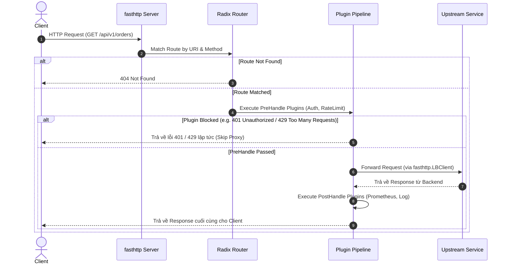

# High-Throughput Go API Gateway (G-Gateway) — Architecture & Design Spec

- **Date**: 2026-07-21
- **Status**: Approved (Full Parity Roadmap & Package Architecture)
- **Author**: Pair Programming Session
- **Go Module Path**: `github.com/QuanTuanHuy/g-gateway`
- **Target Location**: `D:\User2\open_source\gateway`

---

## 1. Executive Summary & Core Requirements

G-Gateway is a high-throughput, low-latency, cloud-native API Gateway written in Go. It is designed to serve as an internal edge/service gateway handling tens of thousands of requests per second (RPS) with near-zero memory overhead and sub-millisecond added latency.

### Key Capabilities
1. **High-Throughput Core Engine**: Built on `fasthttp` using worker pools and zero-allocation byte buffers.
2. **$O(K)$ Radix Tree Router**: Uses `armon/go-radix` for ultra-fast URI & HTTP method matching independent of the number of routes.
3. **Dynamic Real-Time Configuration (0ms Hot-Reloading)**: Uses `sync/atomic.Pointer` for lock-free Copy-On-Write (COW) route table updates driven by etcd or Admin REST API.
4. **Full 7-Phase Lifecycle Architecture**: Matches APISIX lifecycle phases (SSLHandshake, Rewrite, Access, Balancer, HeaderFilter, BodyFilter, Log).
5. **Chain of Responsibility Plugin Pipeline**: Extensible middleware interface with zero-alloc execution paths for Auth, Rate Limiting, CORS, and Observability.

---

## 2. Package Architecture (`github.com/QuanTuanHuy/g-gateway`)

```text
gateway/
├── cmd/
│   └── gateway/
│       └── main.go                  # Gateway entrypoint & CLI flags
├── internal/                        # Internal core packages
│   ├── server/                      # fasthttp Server engine initialization
│   ├── router/                      # Radix tree router wrapper (armon/go-radix)
│   ├── core/                        # RouteTable & sync/atomic.Pointer Swap Engine
│   ├── pipeline/                    # Plugin Pipeline Runner (PreHandle & PostHandle)
│   ├── plugin/                      # Middleware plugin ecosystem
│   │   ├── plugin.go                # Plugin Interface definition
│   │   ├── auth/                    # Key-Auth, JWT Plugins (Phase 3)
│   │   └── logger/                  # Access Logger Plugin
│   ├── proxy/                       # Reverse Proxy Engine & Load Balancer
│   └── config/                      # Config Syncer (etcd watcher / Admin API)
├── docs/                            # Specs & Design docs
│   └── specs/
├── go.mod                           # module github.com/QuanTuanHuy/g-gateway
└── go.sum
```

---

## 3. APISIX vs G-Gateway Architecture Mapping

| APISIX Lifecycle Phase (`init.lua`) | Purpose | G-Gateway Implementation |
| :--- | :--- | :--- |
| `ssl_phase` / `ssl_client_hello` | Dynamic TLS / SNI cert matching | Go `tls.Config.GetCertificate` + `atomic.Pointer[TLSCache]` |
| `http_access_phase` (Rewrite) | Radix Tree routing & URI mutation | Pre-routing stage in `fasthttp` + `armon/go-radix` |
| `http_access_phase` (Access) | Auth, RateLimit, IP Restriction, CORS | Pipeline `PreHandle` Stage |
| `http_balancer_phase` | Upstream LB & Retries | Dynamic Balancer (`fasthttp.LBClient` / Custom Balancer) |
| `header_filter` & `body_filter` | Response Header/Body Transformation | Response Interceptor Stage (`fasthttp.ResponseHeader`/Body) |
| `http_log_phase` | Async Logging & Telemetry | Pipeline `PostHandle` Stage via Async Ring Buffer |
| `stream_preread_phase` (L4) | Layer 4 TCP/UDP Proxying | Independent L4 TCP/UDP Listener (`gnet` / Raw Sockets) |

---

## 4. Detailed Component Specification

### 4.1 Plugin Interface & Pipeline

Every middleware plugin implements the unified `Plugin` interface:

```go
package plugin

import (
	"github.com/valyala/fasthttp"
)

type RouteInfo struct {
	ID        string
	URI       string
	Upstream  string
	Metadata  map[string]interface{}
}

type Plugin interface {
	Name() string
	PreHandle(ctx *fasthttp.RequestCtx, route *RouteInfo) (continueNext bool, err error)
	PostHandle(ctx *fasthttp.RequestCtx, route *RouteInfo) error
}
```

### 4.2 Dynamic Configuration & Lock-Free Atomic Swap

To achieve zero-downtime hot reloading without mutex locks:

```go
package core

import (
	"sync/atomic"
	radix "github.com/armon/go-radix"
)

type RouteTable struct {
	Version   uint64
	Tree      *radix.Tree
	Routes    map[string]*RouteInfo
	Upstreams map[string]*Upstream
}

type Gateway struct {
	routeTable atomic.Pointer[RouteTable]
}

func (g *Gateway) GetRouteTable() *RouteTable {
	return g.routeTable.Load()
}

func (g *Gateway) SwapRouteTable(newTable *RouteTable) {
	g.routeTable.Store(newTable)
}
```

---

## 5. Request Handling Lifecycle & Data Flow



---

## 6. 6-Phase Development Roadmap

### Phase 1: Minimal Core & High-Performance Proxy (MVP Foundation)
- `fasthttp` Engine + `armon/go-radix` Router ($O(K)$ matching).
- `atomic.Pointer[RouteTable]` for 0ms Hot-Reloading.
- Basic Round-Robin Load Balancer & Reverse Proxy.
- Basic 3-stage Pipeline (`PreHandle` -> `Proxy` -> `PostHandle`).

### Phase 2: Full 7-Phase Lifecycle & Dynamic SSL/TLS
- Expand Pipeline to 6 HTTP stages: `SSLHandshake` -> `Rewrite` -> `Access` -> `Balancer` -> `Header/BodyFilter` -> `Log`.
- Dynamic TLS Certificate Loading from etcd/Vault via `tls.Config.GetCertificate`.
- Full Protocol Support: HTTP/1.1, HTTP/2, WebSocket Upgrade (`fasthttp/websocket`).

### Phase 3: Auth, Security & Traffic Control Plugins
- Consumer Abstraction & Multi-Auth (JWT, Key-Auth, Basic-Auth, HMAC).
- Traffic Control: Rate Limiting (Token Bucket & Redis Sliding Window), Concurrency Limit.
- Security: IP Whitelist/Blacklist, CORS, Request JSON Schema Validation.

### Phase 4: Upstream Resiliency & Service Discovery
- Advanced Balancing: Consistent Hashing (Header/Cookie/IP), Weighted RR, Least Conn.
- Active & Passive Health Checking (Background prober).
- Circuit Breaker & Retry Mechanism with Exponential Backoff.
- Service Discovery Integrations: Consul, Nacos, K8s DNS, Eureka.

### Phase 5: Response Transformation & Observability
- Response Transformation: Header/Body modification, gzip/brotli compression, Data Masking.
- Async Logging Engine: Lock-free Ring Buffer pushing to Kafka, Elastic, Syslog.
- Observability: Prometheus Metrics exporter & OpenTelemetry distributed tracing.

### Phase 6: Layer 4 Proxying (TCP/UDP) & Extreme Tuning
- Layer 4 Proxying (TCP/UDP) for Database, Redis, MQTT.
- SIMD JSON Parser: `bytedance/sonic` for 4x faster JSON config parsing.
- Zero-Copy Memory Pools: `fasthttp.byteBufferPool` & `sync.Pool` for zero-allocation hotspots.

---

## 7. Verification & Benchmarking Plan

1. **Unit Tests**:
   - `RouterTest`: Validate Radix Tree matching correctness across static, wildcard, and parameterized paths.
   - `AtomicSwapTest`: Verify thread safety during concurrent reads and swaps under high goroutine contention.
2. **Benchmark Tests**:
   - Run `go test -bench=. -benchmem` to ensure 0 memory allocations in the core routing and pipeline loop.
3. **Integration & Load Tests**:
   - Run `wrk` / `hey` load tests comparing baseline `net/http` vs `fasthttp G-Gateway` targeting 50,000+ RPS.
